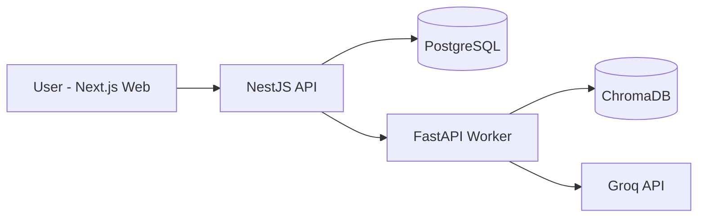

# Architecture Overview

## High-Level Flow

## Responsibility Split

### `apps/web` (Next.js)
- User authentication (register/login UI)
- Chat interface with session history
- File upload and URL ingestion controls
- Retrieval tuning (`namespace`, `top_k`)

### `apps/api` (NestJS)
- Auth + JWT issuance and validation
- User/session/message persistence in PostgreSQL
- Protected REST API consumed by frontend
- Worker orchestration for chat and ingestion
- Centralized validation and error handling

### `apps/worker` (FastAPI)
- Document loading/chunking
- Embedding generation (sentence-transformers)
- ChromaDB upsert/search
- Prompt assembly + Groq generation
- Streaming and non-streaming chat endpoints

## Data Flow: Ingestion

1. Frontend sends file/URL to NestJS
2. NestJS validates request + auth
3. NestJS forwards ingestion request to FastAPI worker
4. Worker loads content, chunks text, embeds chunks, stores in ChromaDB
5. Worker returns ingestion stats to NestJS, then to frontend

## Data Flow: Chat

1. Frontend sends question (optional `sessionId`, `namespace`, `topK`) to NestJS
2. NestJS loads recent chat history from PostgreSQL
3. NestJS calls worker `/chat` with question + condensed history payload
4. Worker retrieves top chunks from ChromaDB and generates response via Groq
5. NestJS stores user and assistant messages in PostgreSQL
6. Frontend renders answer + sources

## Persistence

### PostgreSQL (`apps/api`)
- `users`
- `chat_sessions`
- `chat_messages`

### ChromaDB (`apps/worker`)
- Semantic vectors + chunk metadata
- Namespaces allow logical segmentation

## Security and Reliability

- JWT guard on chat/document endpoints
- DTO validation with whitelist + forbid unknown fields
- Worker failure surfaced as clean 502 responses
- Uploaded files cleaned up after ingestion (success/failure)
- Dockerized services for consistent local deployment
